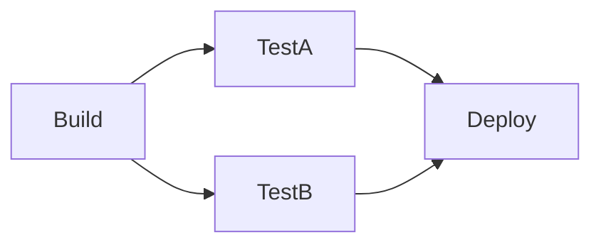

# github actions practice

# workflow 概要

## hello-world.yml
- このワークフローは、手動で実行します。
- `hello-world`ジョブが開始され、echoコマンドを使用して"Hello, world!"というメッセージを出力します。
- また、このワークフローはreusable workflowが使用可能です。

## matrix_strategy.yml
- このワークフローは、手動で実行されます。
- マトリクス戦略を使用して、異なるOS（`ubuntu-latest`, `macos-latest`, `windows-latest`）でそれぞれのジョブが実行されます。
- このワークフローは1次元のマトリックス戦略を使用しており、各OS上でgoのプログラムを実行します。

## matrix_strategy.yml
- このワークフローは、手動で実行されます。
- マトリクス戦略を使用して、異なるOS（`ubuntu-24.04`, `ubuntu-22.04`）と異なるgoのバージョン(`1.22`, `1.21`, `1.20`)でそれぞれのジョブが実行されます。
- このワークフローは2次元のマトリクス戦略を使用しており、各OSとgoのバージョン上でgoのプログラムを実行します。

## on_tags_push.yml
- このワークフローは、`push`イベントがトリガーとなり、タグが作成されたときに実行されます。
- タグの名前のフォーマットは以下のとおりです。
  - `v*.*.*`
  - `test-*`
  - `release-*`
  - `on_tag_push-[0-9]+.[0-9]+.[0-9]+`
- 実行されると、`hello-world`ジョブが開始され、echoコマンドを使用して"Hello, world!"というメッセージがとタグ名が出力されます。
  

## parallel.yml
- このワークフローは、手動もしくは`main`ブランチの`/sample_code/parallel_run.go`が`push`された際に実行されます。
- `parallel`ジョブが開始され、3つのジョブが並行して実行されます。
- それぞれのジョブは、`Build`, `TestA`, `TestB`, `Deploy`という名前が付けられています。
- `TestA`と`TestB`は、`Build`ジョブの完了を待ってから実行されます。
- `Deploy`ジョブは、`TestA`と`TestB`の両方が完了してから実行されます。

ジョブの依存関係は以下のようになります。

## reusable_workflow.yml
- このワークフローは、手動で実行されます。
- `reusable_workflow`ジョブが開始され、外部の`hello-world`ワークフローを呼び出します。
- `hello-world`ワークフローは、`hello-world.yml`ファイルに定義されています。

## run_go_lang.yml
- このワークフローは、手動もしくは`main`ブランチの`/sample_code/**.go`が`push`された際に実行されます。
- `run_go`ジョブが開始され、`go run`コマンドを使用してGoプログラムを実行します。

## send_chatwork.yml
- このワークフローは、手動で実行されます。
- `send_chatwork`ジョブが開始され、マーケットプレイスにあるアクション`okuzawats/chatwork-messaging-action@v1.0`を使用してChatworkにメッセージを送信します。