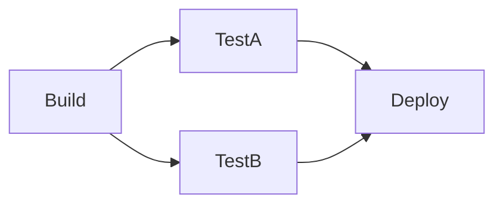

# github actions practice

# workflow 概要

## hello-world.yml
- このワークフローは、手動で実行します。
- 実行されると、`hello-world`ジョブが開始され、echoコマンドを使用して"Hello, world!"というメッセージが出力されます。

## on_tags.yml
- このワークフローは、`push`イベントがトリガーとなり、タグが作成されたときに実行されます。
- タグの名前のフォーマットは以下のとおりです。
  - `v*.*.*`
  - `test-*`
  - `release-*`
  - `on_tag_push-[0-9]+.[0-9]+.[0-9]+`

## parallel.yml
- このワークフローは、手動もしくは`main`ブランチの`/sample_code/parallel_run.go`が`push`された際に実行されます。
- `parallel`ジョブが開始され、3つのジョブが並行して実行されます。
- それぞれのジョブは、`Build`, `TestA`, `TestB`, `Deploy`という名前が付けられています。
- `TestA`と`TestB`は、`Build`ジョブの完了を待ってから実行されます。
- `Deploy`ジョブは、`TestA`と`TestB`の両方が完了してから実行されます。

ジョブの依存関係は以下のようになります。

## run_go_lang.yml
- このワークフローは、手動もしくは`main`ブランチの`/sample_code/**.go`が`push`された際に実行されます。
- `run_go`ジョブが開始され、`go run`コマンドを使用してGoプログラムを実行します。

## send_chatwork.yml
- このワークフローは、手動で実行されます。
- `send_chatwork`ジョブが開始され、マーケットプレイスにあるアクション`okuzawats/chatwork-messaging-action@v1.0`を使用してChatworkにメッセージを送信します。